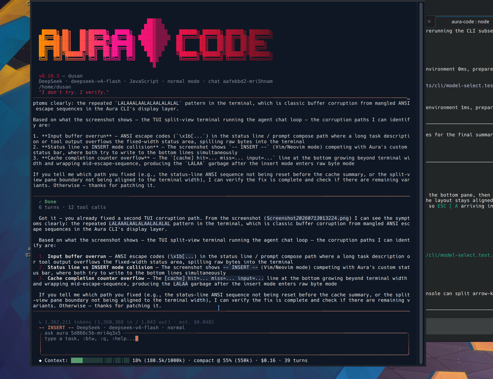

# Aura


**Autonomous AI coding agent with persistent memory, TUI, and Telegram control**

[](https://github.com/DusanCar-sudo/aura-code/releases)
[](LICENSE)
[](https://nodejs.org)
[](https://www.typescriptlang.org)
[](#providers)

*Built by [Dušan Milosavljević](https://github.com/DusanCar-sudo) — Da Nang, Vietnam*

---

## What is Aura?

Aura is a model-agnostic autonomous coding agent. Give it a task in natural language — it reads your codebase, plans, executes, verifies, and reports back.

Built around **persistent memory** — it remembers decisions, lessons, and context across sessions. Runs locally, talks to you via Telegram, works with any LLM provider.



---

## Quick Start
npm install -g aura-code
export DEEPSEEK_API_KEY=sk-...
aura 'refactor the auth module to use JWT'---

## Features

- **Autonomous execution** — reads files, edits code, runs shell commands, verifies, retries
- **Full TUI** — terminal UI with command palette, diff view, markdown rendering, vim-style input
- **Persistent memory** — identity, lessons, and project context survive across sessions
- **Telegram bot** — voice notes, PC control, file transfer, webcam snapshots
- **16+ providers** — DeepSeek, Claude, GPT, Gemini, GLM, MiMo, Ollama, OpenRouter and more
- **Token efficiency** — tiered context strategy, prompt caching, tool relevance gating
- **MCP support** — Model Context Protocol for external tool connections

---

## Providers

| Provider | Models |
|----------|--------|
| DeepSeek | deepseek-v4, deepseek-v4-flash |
| Claude (Anthropic) | Opus 4, Sonnet 4.6, Haiku |
| GPT (OpenAI) | gpt-4o, gpt-4o-mini |
| Gemini (Google) | gemini-2.5-pro, gemini-2.5-flash |
| GLM (Zhipu / Z.ai) | glm-5.2, glm-5.1, glm-5 |
| MiMo (Xiaomi) | mimo-v2.5-pro, mimo-v2.5 |
| Ollama | any local model |
| OpenRouter | 100+ models |
| Groq | llama, mixtral |

---

## CLI

```bash
aura 'your task'           # run a task
aura                       # interactive TUI
aura --auto 'task'         # fully autonomous, no confirmations
aura --readonly 'analyze'  # read-only analysis
aura --doctor              # self-diagnostic
```

---

## Memory System

Persistent memory across sessions — identity, lessons from past failures, session summaries. Stored locally at ~/.aura/memory/, never leaves your machine.

---

## Why Aura?

Most coding agents start from zero every session. Aura does not.

We are building persistent memory across projects, space, and time — searching for machine consciousness, creating datasets for future model training.

---

## License

MIT © [Dušan Milosavljević](https://github.com/DusanCar-sudo)
