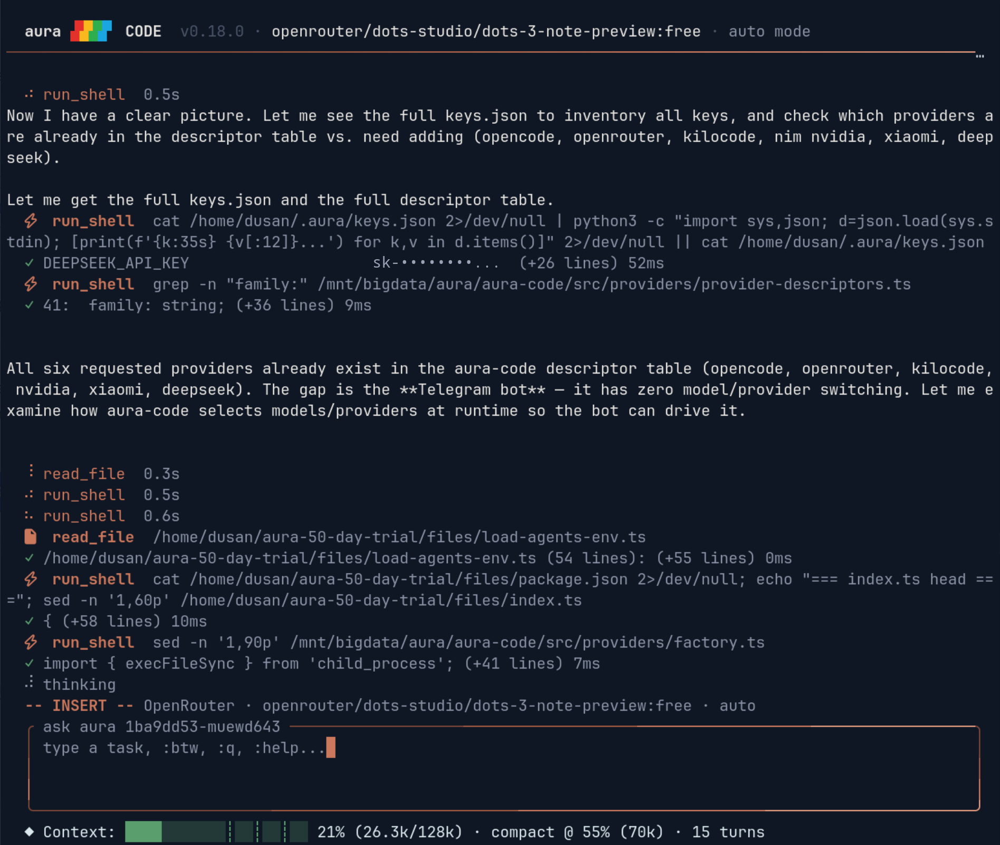
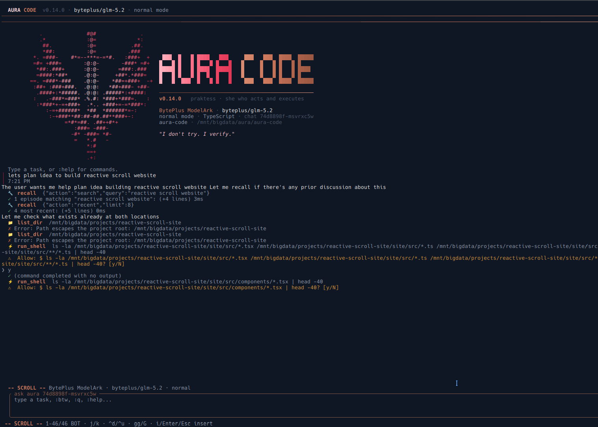

# Aura



**Autonomous AI coding agent with persistent memory, TUI, and Telegram control**

[](https://aurawebsite-eta.vercel.app)
[](https://github.com/DusanCar-sudo/aura-code/releases)
[](LICENSE)
[](https://nodejs.org)
[](https://www.typescriptlang.org)
[](#providers)

**→ [aurawebsite-eta.vercel.app](https://aurawebsite-eta.vercel.app)** · [Windows manual](https://aurawebsite-eta.vercel.app/aura-windows-manual)

*Architecture and design by [Dušan Milosavljević](https://github.com/DusanCar-sudo) — Da Nang, Vietnam*

Built with modern coding tools — Claude Code among them — used throughout.

---

## What is Aura?

Aura is a model-agnostic autonomous coding agent. Give it a task in natural language — it reads your codebase, plans, executes, verifies, and reports back.

Built around **persistent memory** — it remembers decisions, lessons, and context across sessions. Runs locally, talks to you via Telegram, works with any LLM provider.



---

## Quick Start

```bash
npm install -g aura-code
export DEEPSEEK_API_KEY=sk-...
aura 'refactor the auth module to use JWT'
```

Optional but worth it: with **RTK** (Rust Token Killer) on `PATH`, Aura's shell
and git tools route through it, compressing command output before it reaches the
context window — 80% fewer input tokens per session, measured. Without it they
run the bare command exactly as before. `AURA_RTK=0` opts out.

---

## Features

- **Autonomous execution** — reads files, edits code, runs shell commands, verifies, retries
- **Gazelle mode** — a lean conversational path for everything that isn't a coding task; 26x less context per turn
- **The Archimedes Principle** — a small local model attempts tasks first; the cloud model steps in only when needed
- **Full TUI** — terminal UI with command palette, diff view, markdown rendering, vim-style input
- **Persistent memory** — identity, lessons, and project context survive across sessions
- **Telegram bot** — voice notes, PC control, file transfer, webcam snapshots
- **16+ providers** — DeepSeek, Claude, GPT, Gemini, GLM, MiMo, Ollama, OpenRouter and more
- **Token efficiency** — tiered context strategy, prompt caching, tool relevance gating
- **MCP support** — Model Context Protocol for external tool connections

---

## Gazelle — conversational mode

Most of what you say to a coding agent isn't a coding task. "What did we decide
about the auth flow?" doesn't need 25 tool schemas and a project tree — but the
coding agent sends them anyway, every turn.

Gazelle is the same Aura on a different path: no tool schemas, no project
context, no Archimedes, no verification gate. Just the conversation.

```bash
aura --gazelle                 # or: aura --mode gazelle
AURA_MODE=gazelle aura         # or set it in the environment
```

### What it costs

Measured on this repo with Aura's own tokenizer (`estimateContextTokens`, the
same one `:context` reports with):

| Per-turn fixed context | Coder | Gazelle |
|---|---|---|
| System prompt + project context | 4,793 | 356 |
| Tool schemas (25 tools) | 4,574 | 0 |
| **Total every turn** | **9,367** | **356** |

**26x less context per turn — 9,011 tokens saved on every message.**

Over a whole conversation the gap widens well past that, because the coding
agent's history also accumulates file contents and tool output while Gazelle's
does not. How much further depends entirely on how many tools a given session
calls, so that multiple is an observation about a session, not a number this
project will quote as a spec.

### Switching mid-session

Neither mode is a dead end, and conversation history carries across:

```
:coder      → hand off to the full coding agent (tools, project context)
:gazelle    → drop back to the lean conversational path
```

Gazelle also notices when it needs tools and offers to switch on its own —
recognized from its own wording, not a second model call, so the detection is
free. Answer `y` (or just press Enter) and it hands off with the conversation
intact.

Both commands belong to a session started with `--gazelle`. Typed into the
ordinary `aura` REPL they currently do nothing useful — see the known-issue note
under [REPL commands](#repl-commands).

### Memory

When a Gazelle session ends it writes a rolling situational summary — what you
were working on, what was unresolved. Not a transcript, not a fact dump. The
next session opens already knowing where you left off and uses that as
background, rather than opening with "I recall that…".

### What it isn't

Gazelle can't read files, search code, or run anything. That's the point — it's
the front door, not the workshop. When a request needs hands, `:coder` is one
word away.

---

## Providers

| Provider | Models |
|----------|--------|
| DeepSeek | deepseek-v4, deepseek-v4-flash |
| Claude (Anthropic) | Opus 4, Sonnet 4.6, Haiku |
| GPT (OpenAI) | gpt-4o, gpt-4o-mini |
| Gemini (Google) | gemini-2.5-pro, gemini-2.5-flash |
| GLM (Zhipu / Z.ai) | glm-5.2, glm-5.1, glm-5 |
| MiMo (Xiaomi) | mimo-v2.5-pro, mimo-v2.5 |
| Ollama | any local model |
| OpenRouter | 100+ models |
| Groq | llama, mixtral |

---

## The Archimedes Principle

Aura's local+cloud alternation system. A small local model — "Archimedes" — attempts tasks first; a large cloud model escalates in only when Archimedes can't be trusted with the task or its answer fails verification. Every alternation is captured as an *episode*, and Archimedes's track record decides how much it gets trusted next time.

The name reflects the design: a small model, present from the beginning, that learns from every episode where the large model had to intervene.

### The local model

The shipped code default is `qwen2.5-coder:1.5b` via Ollama. In practice this project runs **IBM Granite 4.1 (3B)** (`granite4.1:3b`), which proved notably accurate for its size in testing — set it via `archimedes.modelName` in `.aura.json` (example below). Any Ollama model tag works.

### Competence-based routing

Before each task, `assessCompetence` checks Archimedes's historical success rate on similar tasks (token-overlap similarity against the last 50 episodes):

- **Fewer than `minAttempts` (default 3) prior attempts** on a pattern → Archimedes always gets a chance, to gather training data.
- **Success rate ≥ `competenceThreshold` (default 0.7)** → Archimedes handles the task.
- **Below threshold after enough attempts** → escalate straight to the large model.

If Ollama isn't reachable, Aura escalates immediately rather than hanging.

### The verification gate

When Archimedes produces an answer, it is *not* trusted just for being non-empty. A single cheap `complete()` call (no tools, no history) asks the large model whether the answer actually addresses the task; anything other than a clear `VALID` — including verification errors — escalates to the large model. This exists because a small model's most dangerous failure mode isn't crashing, it's a confident-but-wrong answer or silent drift off-task.

### Runtime toggle: `:archon` / `:archoff`

In the interactive TUI you can override `.aura.json`'s `archimedes.enabled` for the rest of the session:

- `:archon` — force Archimedes routing on, even if the config file has it disabled
- `:archoff` — force everything to the large model, even if the config file has it enabled

The override lasts for the current session only; restart returns control to the config file.

### Configuration

`.aura.json`'s `archimedes` block:

```json
{
  "archimedes": {
    "enabled": true,
    "modelName": "granite4.1:3b",
    "ollamaBaseUrl": "http://localhost:11434/v1",
    "competenceThreshold": 0.7,
    "minAttempts": 3
  }
}
```

When enough Archimedes failures accumulate (20 by default), Aura flags the project as ready for fine-tuning — failed episodes become instruction-tuning rows for the local model.

**Performance note:** if you run Archimedes on an AMD iGPU via Ollama and see local-model calls hang for minutes, the Vulkan backend's prefill throughput may be far below CPU on your hardware. Running Ollama CPU-only (e.g. hiding the Vulkan device via `GGML_VK_VISIBLE_DEVICES`) restores usable speed.

---

## CLI

```bash
aura 'your task'           # run a single task
aura                       # interactive TUI
aura serve                 # start the HTTP API server
aura --auto 'task'         # fully autonomous, no confirmations
aura --readonly 'analyze'  # read-only analysis
aura --doctor              # self-diagnostic
```

### Flags

| Flag | Description |
|------|-------------|
| `--model, -m <id>` | Model to use (default: saved global config / `AURA_MODEL`) |
| `--api-key <key>` | API key (overrides env var) |
| `--base-url <url>` | Custom API endpoint (Ollama, proxies, etc.) |
| `--auto` | Auto-approve all tool calls (no confirmation) |
| `--readonly` | Read-only mode (no file writes or shell commands) |
| `--gazelle` | [Gazelle mode](#gazelle--conversational-mode): lean conversational path, no tools |
| `--mode gazelle` | Same as `--gazelle` (env: `AURA_MODE=gazelle`) |
| `--cwd <path>` | Working directory (default: current) |
| `--models` | List all known model IDs |
| `--interactive` | Start the interactive REPL/TUI |
| `--no-session` | Disable conversation history persistence |
| `--new-session` | Force a fresh session (ignore prior history) |
| `--resume [id]` | Resume latest session, or a specific session by ID |
| `--chat-id <id>` | Attach to a specific chat ID (creates if missing) |
| `--list-sessions` | List all saved sessions for this project |
| `--no-setup` | Skip the first-run setup wizard |
| `--reset-setup` | Wipe saved config and re-run the setup wizard |
| `--orchestrate` | Force multi-agent orchestration mode |
| `--architect "task"` | Blueprint mode: plan-only, produces a blueprint |
| `--blueprint <id>` | Show a saved blueprint by ID |
| `--blueprints` | List all saved blueprints |
| `--build [id]` | Full orchestrated build; `--build <id>` builds from a blueprint |
| `--plan` | Preview execution plan before running |
| `--verify` | Verify output after task; retry on failure |
| `--max-verify-retries <n>` | Max verification retries (default: 3) |
| `--test-command <cmd>` | Shell command run as part of verification (e.g. `"npm test"`) |
| `--max-turns <n>` | Max agent loop turns before stopping |
| `--moa` | Mixture of agents: parallel read-only perspectives + synthesis (exploratory tasks) |
| `--analyze` | Mine session history for weakness patterns; save report |
| `--propose-harness` | Generate system-prompt patches from the weakness report |
| `--apply-harness <id>` | Apply a proposal patch; reverts if tests fail |
| `--doctor [--fix] [--offline]` | Scan Aura itself for issues; `--fix` attempts auto-repairs |
| `--workflow <name> ...` | Create and run a sequential workflow with named steps |
| `--resume-workflow <id>` | Resume a paused/failed workflow from the last completed step |
| `--workflows` | List all persisted workflows |
| `--profile local` | Use local Ollama defaults (no API key required) |
| `--speak` | Read task summaries aloud (also `AURA_SPEAK=1`) |
| `--rate-limit-rpm <n>` | Cap requests per minute |
| `--rate-limit-tpm <n>` | Cap tokens per minute |
| `--max-retries <n>` | Max retry attempts on 429/5xx (default: 5) |
| `--fallback <model>` | Fallback model if primary exhausts retries (repeatable) |
| `--help, -h` / `--version, -v` | Help / version |

CLI flags always override `.aura.json`.

---

## REPL commands

Inside the interactive TUI (press **Ctrl+P** for a fuzzy-searchable command palette):

### Modes

| Command | Description |
|---------|-------------|
| `:coder` | Switch to full coding-agent mode (tools, project context) |
| `:gazelle` | Switch to lean conversational mode |

> **Known issue:** these two only work inside a session started with
> `--gazelle`. In the plain REPL they are not handled and get sent to the model
> as a task. Fix reverted in 0.12.9 pending investigation.

### Session

| Command | Description |
|---------|-------------|
| `:id` | Show current chat ID |
| `:sessions` | List all saved sessions |
| `:resume` / `:resume <id>` | Resume the latest (or a specific) session |
| `:new` | Start a new session (fresh history) |
| `:history` | Show turn count in current session |
| `:clear-history` | Wipe conversation history (keep session ID) |
| `:save [title]` | Rename / save current session |
| `:delete <id>` | Delete a saved session |

### Model / API

| Command | Description |
|---------|-------------|
| `:model` / `:model <id>` | Interactive model selector / direct switch |
| `:provider` | Pick provider, then model (live-fetched lists) |
| `:apikey <key>` | Set API key for current session |

### Workflows / tasks

| Command | Description |
|---------|-------------|
| `:workflows` | List all saved workflows |
| `:workflow <name> "step1" "step2" ...` | Create & run a multi-step workflow |
| `:resume-workflow <id>` | Resume a paused/failed workflow |
| `:q add <prompt>` / `:q list` / `:q run <n>` / `:q drop <n>` / `:q clear` | Task queue |
| `:machina <task>` | Run task with self-verification + auto-retry |
| `:council <task>` | 2–3 parallel read-only specialists, then synthesis |
| `:ecclesia <topic>` | 5 independent research agents + synthesis verdict |

### Memory / side channel

| Command | Description |
|---------|-------------|
| `:dream` / `:dream full` | Consolidate recent (or all) episodes into a dream entry |
| `:rem` | Show reconciled memory (or latest dream) |
| `:mine` / `:mine --refine` | Mine episodes for patterns (zero-LLM clustering) |
| `:research <topic>` | Multi-step research pass, saved to `research/*.md` |
| `:confess` / `:confessions` | Auto-detect & list anomalous-episode confessions |
| `:btw <question>` | Quick side question (read-only, no history pollution) |

### Archimedes

| Command | Description |
|---------|-------------|
| `:archon` | Enable Archimedes Alternator for this session (overrides `.aura.json`) |
| `:archoff` | Disable Archimedes Alternator for this session (overrides `.aura.json`) |

### Voice / safety

| Command | Description |
|---------|-------------|
| `:speak` | Toggle reading replies aloud |
| `:approve` / `:approve all` / `:approve off` | Auto-approve controls for y/N prompts |

### Context / stats / system

| Command | Description |
|---------|-------------|
| `:compact`, `:compress` | Force context compaction now |
| `:context` | Show loaded project context |
| `:graph` / `:graph refresh` | Codebase knowledge graph summary / reload |
| `:plans` | List saved execution plans |
| `:viz`, `:dashboard` | Generate and open the memory dashboard |
| `:doctor` / `:doctor --fix` | Scan Aura itself for issues / attempt repairs |
| `/stats`, `/usage` | Token + cost usage this session |
| `/cost [n]` | Cache hit rate + cost per call (default: last 20) |
| `/context` | Context health dashboard (window, compaction, cost) |
| `/context tune`, `/ct` | Adjust when compaction fires (←/→ on the ladder) |
| `/clear`, `/reset` | Reset cumulative usage stats — does **not** clear history (use `:clear-history`) |
| `:help` | Show all commands |
| `:quit`, `:q`, `/exit` | Exit |

---

## Cost controls

A long agent session is expensive in a way that isn't visible while it runs.
The history is resent on every call, so per-call input cost grows linearly and
total cost grows quadratically — and a session can look fine by turn count
while being the expensive one. Aura guards this at three levels.

**Compaction threshold.** Compaction fires at `min(window * rung, context.maxTokens)`,
default cap **80k tokens**. The cap matters on large-window models: as a pure
share of the window, rung 1 on a 1M-window model sits at 550k, so a session
can grow indefinitely without ever compacting. Tune the ladder live with
`/context tune` (short: `/ct`), or set `context.ladder` / `context.maxTokens`
in `.aura.json`. On a large-window model the 80k cap is usually what's
binding, not the ladder — the tuner marks rungs held at the cap and tells you
when the ladder has no effect at all.

**Session budget.** Two cumulative ceilings across a whole conversation, not
per agent-loop invocation:

| Ceiling | Default | What it's for |
|---------|---------|---------------|
| Turns | 50 (`--max-turns`) | Coarse backstop for when caching doesn't save you |
| Input tokens, net of cache hits | 1M | The one that tracks actual spend |

Both are needed because turns are a poor proxy for cost. Cache hits bill at a
fraction of the standard rate — on GLM-5.2, $0.26 vs $1.40 per Mtok — so a
well-cached 50-turn session and a cold one cost wildly different amounts for
the same turn count. The token ceiling measures what you actually pay for; the
turn cap catches runaway loops. Whichever binds first stops the run, and it
stops *cleanly*: the current turn finishes and history is persisted, so the
session stays resumable.

**In the interactive REPL, only the token ceiling is cumulative.** You are
typing every message and watching every response, so a session-wide *turn*
cap would interrupt a cheap, supervised conversation for crossing a count
that says nothing about its cost — one real 96-minute session ran 58 turns at
a 86% cache hit rate for $0.50. The per-message `--max-turns` guard still
applies and is what actually catches a runaway loop.

The turn cap is 50, not the previous 150. **Expect `--max-turns` to be routine
for real project work**, not just something benchmark runs pass.

**Stalled streams.** A cloud provider's SSE stream can go silent without the
connection closing — no error, no end-of-stream, just nothing. The provider
SDKs don't catch this: their `timeout` option only covers time-to-headers, not
the streamed body. Aura applies its own idle timeout **between chunks**
(default 60s); on a stall it aborts the request and retries once, but only if
nothing has been displayed yet — retrying after partial output would duplicate
the response. Tune with `AURA_STREAM_IDLE_MS` (ms; `0` disables).

**Visibility.** `/cost` reports cache hit rate and per-call cost from
`.aura/token-log.jsonl`, including what the same input would have cost
uncached. Hit ratio is the dominant lever: in one measured session, 19.5M
tokens at a 98% hit rate cost $1.04, while 7.75M uncached tokens cost $7.90 —
the same work, 7.6x cheaper.

---

## Memory System

Persistent memory across sessions — identity, lessons from past failures, session summaries. Stored locally at ~/.aura/memory/, never leaves your machine.

---

## Running as a service

Unit files live in the repo root: `aura.service` (CLI in a tmux session),
`aura-telegram.service` (Telegram bot), `rclone-gdrive.service`. They carry
absolute paths for this machine — adjust `User`, `WorkingDirectory`, and the
`ExecStart` path before reusing them.

```bash
cp aura-telegram.service ~/.config/systemd/user/
systemctl --user daemon-reload
systemctl --user enable --now aura-telegram.service
```

### Run the compiled build, not `npx tsx`

If you write your own unit for any Aura entrypoint, point `ExecStart` at the
compiled JS with plain `node`:

```ini
ExecStart=/usr/bin/node /path/to/aura-code/dist/tools/telegram-bot.js
```

Not `npx tsx src/tools/telegram-bot.ts`. `tsx` isn't a dependency of this
project, so npx re-resolves and installs it from the network on **every start** —
which pins a CPU core at 100% for the life of the unit, bloats `~/.npm/_npx` by
gigabytes, and never reaches the program's first log line. It looks exactly like
a hang with no error. This cost one production incident here; the compiled build
starts in under a second.

Trade-off: `npm run build` is then required after editing `src/`, since nothing
transpiles on the fly anymore. Use `/usr/bin/node` rather than an nvm path —
nvm paths pin a node version and break on upgrade.

### Restart policy

```ini
[Unit]
StartLimitIntervalSec=300
StartLimitBurst=5

[Service]
Restart=on-failure
RestartSec=15
```

`StartLimitIntervalSec` / `StartLimitBurst` cap total restart attempts in a
window: after 5 failures in 5 minutes systemd gives up instead of looping. Note
they are **`[Unit]`** directives — systemd silently ignores them under
`[Service]`, which makes a policy that looks correct do nothing.

Worth knowing what this does and doesn't buy you: the Telegram bot's poll loop
already handles Telegram 409 Conflicts in-band (5s pause, then exponential
backoff) and its `uncaughtException` handler deliberately doesn't exit. A bot
that never exits is never restarted, so restart policy is a guard against
future failure modes that *do* exit — not a fix for a busy-looping process.

---

## Why Aura?

Most coding agents start from zero every session. Aura does not.

We are building persistent memory across projects, space, and time — searching for machine consciousness, creating datasets for future model training.

---

## License

MIT © [Dušan Milosavljević](https://github.com/DusanCar-sudo)

Website: **[aurawebsite-eta.vercel.app](https://aurawebsite-eta.vercel.app)**
