# Aura Code — Architecture

```mermaid
graph TB
    subgraph CLI["CLI Layer"]
        CLI_INDEX["src/cli/index.ts<br/>Entry point — arg parsing, REPL, task dispatch"]
        DISPLAY["src/cli/display.ts<br/>Terminal output"]
        DIAMOND["src/cli/diamond.ts<br/>ASCII art"]
    end

    subgraph AGENT["Agent Loop"]
        LOOP["src/agent/loop.ts<br/>runAgentLoop — LLM stream loop<br/>tool execution & confirmation"]
        CONTEXT["src/agent/context.ts<br/>Project context loading"]
        SYSTEM_PROMPT["src/agent/system-prompt.ts<br/>System prompt builder"]
        SPAWNER["src/agent/spawner.ts<br/>Sub-agent spawning"]
        SESSION["src/agent/session-store.ts<br/>Chat persistence"]
        COMPACTOR["src/agent/compactor.ts<br/>History compaction at ~70% context"]
    end

    subgraph PROVIDERS["Provider Layer"]
        FACTORY["src/providers/factory.ts<br/>Provider registry"]
        RESILIENT["src/providers/resilient.ts<br/>Provider with retries"]
        RESILIENT_FACTORY["src/providers/resilient-factory.ts<br/>Resilient provider factory"]
        FALLBACK["src/providers/fallback.ts<br/>Model fallback chain"]
        TYPES["src/providers/types.ts<br/>LLMProvider interface"]
        ANTHROPIC["src/providers/anthropic.ts"]
        GOOGLE["src/providers/google.ts"]
        OPENAI["src/providers/openai-compatible.ts"]
    end

    subgraph ORCHESTRATION["Orchestration"]
        ROUTER["src/orchestration/router.ts<br/>Task routing"]
        ORCHESTRATOR["src/orchestration/orchestrator.ts<br/>Task decomposition"]
        EXECUTOR["src/orchestration/executor.ts<br/>Specialist execution"]
        SPECIALISTS["src/orchestration/specialists.ts<br/>Specialist agents"]
        PLAN_STORE["src/orchestration/plan-store.ts<br/>Plan persistence"]
        ORCH_COMPETENCE["src/orchestration/competence.ts<br/>Specialist-role scoring<br/>distinct from Ruby's competence below"]
        RUBY_DETECT["src/orchestration/ruby-detect.ts<br/>Ruby trait detection"]
    end

    subgraph RUBY["Self-Improvement (Ruby)"]
        ALTERNATOR["src/ruby/alternator.ts<br/>RubyAlternator — tries a free local<br/>Ollama model before the configured<br/>large model, based on competence"]
        RUBY_COMPETENCE["src/ruby/competence.ts<br/>assessCompetence — Ruby-vs-large-model<br/>decision, separate from orchestration's"]
        EPISODE_CAPTURE["src/ruby/episode-capture.ts<br/>episodeStore — records every<br/>task outcome as an Episode"]
        MODEL_SELECTOR["src/ruby/model-selector.ts<br/>selectModel — picks the best same-family<br/>model from episode history"]
        STATS["src/ruby/stats.ts<br/>formatStats — pure function used by<br/>--stats; caller loads episodes"]
        TRAINING_DATA["src/ruby/training-data.ts<br/>Builds fine-tuning examples from episodes —<br/>exported but not wired into any CLI command"]
        FINE_TUNE["src/ruby/fine-tune.ts<br/>Fine-tunes via OpenAI API or Ollama —<br/>also exported but unwired, like the above"]
    end

    subgraph PERCEPTION["Codebase Perception"]
        EXTRACTOR["src/perception/extractor.ts<br/>Codebase parsing & indexing"]
        GRAPH_STORE["src/perception/graph-store.ts<br/>Dependency graph storage +<br/>saveGraphForViz for the dashboard"]
        QUERIES["src/perception/queries.ts<br/>Graph queries"]
    end

    subgraph DASHBOARD["Dashboard"]
        VIZ["src/viz/index.ts<br/>generateDashboard — HTML dashboard:<br/>codebase graph, memory growth,<br/>learning/episode charts"]
    end

    subgraph HARNESS["Self-Analysis (Harness)"]
        WEAKNESS_MINER["src/harness/weakness-miner.ts<br/>--analyze: mines session history<br/>for recurring failure patterns"]
        PROPOSER["src/harness/proposer.ts<br/>--propose-harness: generates<br/>system-prompt patches"]
    end

    subgraph HIGHER_MODES["Higher-Level Modes"]
        WORKFLOWS["src/workflows/engine.ts<br/>--workflow: multi-step pipelines"]
        ARCHITECT["src/architect/engine.ts<br/>--architect: blueprint-based planning"]
    end

    subgraph TOOLS["Tool System"]
        TOOLS_INDEX["src/tools/index.ts<br/>Tool registry & dispatch"]
        READ_FILE["src/tools/read-file.ts"]
        WRITE_FILE["src/tools/write-file.ts"]
        EDIT_FILE["src/tools/edit-file.ts"]
        SEARCH_CODE["src/tools/search-code.ts"]
        RUN_SHELL["src/tools/run-shell.ts"]
        RUN_TESTS["src/tools/run-tests.ts"]
        BROWSER["src/tools/browser.ts"]
        WEB_FETCH["src/tools/web-fetch.ts"]
        WEB_SEARCH["src/tools/web-search.ts"]
        MCP["src/tools/mcp.ts<br/>MCP client"]
        MEMORY["src/tools/memory.ts"]
    end

    subgraph SAFETY["Safety Layer"]
        PERMISSIONS["src/safety/permissions.ts<br/>PermissionSystem & confirm()"]
    end

    subgraph VERIFY["Verification Layer"]
        CHECKS["src/verify/checks.ts<br/>Verification checks"]
        INDEX["src/verify/index.ts<br/>runWithVerification"]
    end

    subgraph CONFIG["Configuration"]
        PROJECT_CONFIG["src/config/project-config.ts<br/>Project .aura.json<br/>includes ruby.enabled override"]
        DEFAULTS["src/config/defaults.ts<br/>Default values & safety lists"]
        GLOBAL_CONFIG["src/setup/global-config.ts"]
        FIRST_RUN["src/setup/first-run.ts<br/>Setup wizard"]
    end

    CLI_INDEX --> LOOP
    CLI_INDEX --> DISPLAY
    CLI_INDEX --> ROUTER
    CLI_INDEX --> ORCHESTRATOR
    CLI_INDEX --> FIRST_RUN
    CLI_INDEX --> ALTERNATOR
    CLI_INDEX --> MODEL_SELECTOR
    CLI_INDEX --> STATS
    CLI_INDEX --> VIZ
    CLI_INDEX --> WEAKNESS_MINER
    CLI_INDEX --> PROPOSER
    CLI_INDEX --> WORKFLOWS
    CLI_INDEX --> ARCHITECT

    LOOP --> PROVIDERS
    LOOP --> TOOLS_INDEX
    LOOP --> PERMISSIONS
    LOOP --> SYSTEM_PROMPT
    LOOP --> CONTEXT
    LOOP --> SPAWNER
    LOOP --> COMPACTOR

    ROUTER --> PERCEPTION
    ROUTER --> ORCHESTRATOR

    ORCHESTRATOR --> EXECUTOR
    ORCHESTRATOR --> PLAN_STORE
    EXECUTOR --> SPECIALISTS
    SPECIALISTS --> LOOP
    EXECUTOR --> ORCH_COMPETENCE

    ALTERNATOR --> LOOP
    ALTERNATOR --> RUBY_COMPETENCE
    ALTERNATOR --> EPISODE_CAPTURE
    MODEL_SELECTOR --> EPISODE_CAPTURE

    VIZ --> EPISODE_CAPTURE

    PROPOSER --> WEAKNESS_MINER

    RESILIENT_FACTORY --> RESILIENT
    RESILIENT --> FALLBACK
    FALLBACK --> ANTHROPIC
    FALLBACK --> GOOGLE
    FALLBACK --> OPENAI

    TOOLS_INDEX --> READ_FILE
    TOOLS_INDEX --> WRITE_FILE
    TOOLS_INDEX --> EDIT_FILE
    TOOLS_INDEX --> SEARCH_CODE
    TOOLS_INDEX --> RUN_SHELL
    TOOLS_INDEX --> RUN_TESTS
    TOOLS_INDEX --> BROWSER
    TOOLS_INDEX --> WEB_FETCH
    TOOLS_INDEX --> WEB_SEARCH
    TOOLS_INDEX --> MCP
    TOOLS_INDEX --> MEMORY

    PERCEPTION --> EXTRACTOR
    PERCEPTION --> GRAPH_STORE
    PERCEPTION --> QUERIES

    VERIFY --> LOOP

    classDef entryClass fill:#fde4d0,stroke:#f0883e,stroke-width:2px,color:#1a1a1a
    classDef coreClass fill:#d6e8fc,stroke:#1f6feb,stroke-width:2px,color:#1a1a1a
    classDef routingClass fill:#ecdcfc,stroke:#8957e5,stroke-width:2px,color:#1a1a1a
    classDef knowledgeClass fill:#d7f5dd,stroke:#2ea043,stroke-width:2px,color:#1a1a1a
    classDef toolsClass fill:#fbe7b8,stroke:#bf8700,stroke-width:2px,color:#1a1a1a
    classDef safetyClass fill:#fbdada,stroke:#cf222e,stroke-width:2px,color:#1a1a1a
    classDef configClass fill:#e8e8e8,stroke:#6e7681,stroke-width:2px,color:#1a1a1a

    class CLI_INDEX,DISPLAY,DIAMOND entryClass
    class LOOP,CONTEXT,SYSTEM_PROMPT,SPAWNER,SESSION,COMPACTOR,FACTORY,RESILIENT,RESILIENT_FACTORY,FALLBACK,TYPES,ANTHROPIC,GOOGLE,OPENAI coreClass
    class ROUTER,ORCHESTRATOR,EXECUTOR,SPECIALISTS,PLAN_STORE,ORCH_COMPETENCE,RUBY_DETECT,ALTERNATOR,RUBY_COMPETENCE,EPISODE_CAPTURE,MODEL_SELECTOR,STATS,TRAINING_DATA,FINE_TUNE routingClass
    class EXTRACTOR,GRAPH_STORE,QUERIES,VIZ,WEAKNESS_MINER,PROPOSER,WORKFLOWS,ARCHITECT knowledgeClass
    class TOOLS_INDEX,READ_FILE,WRITE_FILE,EDIT_FILE,SEARCH_CODE,RUN_SHELL,RUN_TESTS,BROWSER,WEB_FETCH,WEB_SEARCH,MCP,MEMORY toolsClass
    class PERMISSIONS,CHECKS,INDEX safetyClass
    class PROJECT_CONFIG,DEFAULTS,GLOBAL_CONFIG,FIRST_RUN configClass
```

## Flow

1. **CLI entry** (`src/cli/index.ts`) parses args, loads config (including `.aura.json`), runs the setup wizard if needed.
2. **Single task mode**: the task is dispatched to the router, which decides between direct agent execution and orchestrated decomposition.
   - **Direct execution** first runs competence-based model selection (`selectModel`) among your already-configured models, then — if Ruby-alternation is enabled (`ruby.enabled` in `.aura.json`, on by default) — `RubyAlternator` decides whether to try a free local Ollama model first, based on past competence for similar tasks, only escalating to the configured large model if Ruby doesn't produce a usable result or isn't reachable.
   - **Orchestrated decomposition** breaks the task into sub-tasks routed to specialist agents, using a *separate* competence-scoring module (`src/orchestration/competence.ts`) that scores specialist roles, not Ruby-vs-large-model choices.
3. **REPL mode**: an interactive readline loop accepts tasks, runs the same direct-execution path (model selection → optional Ruby-alternation → agent loop) per turn, and persists chat history for multi-turn continuation.
4. **Agent loop** (`src/agent/loop.ts`): streams LLM responses, executes tool calls via the tool registry, handles permission confirmations, and compacts history once usage crosses ~70% of the model's context window.
5. **Provider layer**: abstracts LLM backends — Anthropic, Google, OpenAI-compatible (including DeepSeek, MiMo, OpenRouter, Ollama). Supports retries, rate limiting, and fallback chains.
6. **Tool system**: each tool (`read_file`, `write_file`, `run_shell`, etc.) is a standalone module registered in the tool index.
7. **Safety**: `PermissionSystem` enforces read-only/normal/auto modes. The `confirm()` function prompts the user before destructive operations — including during a Ruby-alternation attempt, which respects the same permission mode as the rest of the session.
8. **Verification**: optional post-task verification runs tests and retries on failure. Verification always runs directly against the selected model — it does not currently support Ruby-alternation.
9. **Episode feedback loop**: every task outcome — whether it ran through plain execution, RubyAlternator, or orchestration — is captured as an `Episode` (`src/ruby/episode-capture.ts`). Episodes feed `selectModel`'s history-based suggestions, `RubyAlternator`'s competence decisions, `--stats`, and the dashboard's Learning tab. `training-data.ts` and `fine-tune.ts` can turn that same episode history into actual model fine-tuning, but neither is currently called from any CLI command — the capability exists, nothing in the CLI invokes it yet.
10. **Dashboard** (`:viz` / `--viz`): generates an HTML dashboard from session history, the memory store, episode data, and the codebase knowledge graph — including a force/radial 2D graph view and 3D exploration modes.
11. **Self-analysis**: `--analyze` mines session history for recurring failure patterns; `--propose-harness` turns those patterns into system-prompt patch proposals.

## Key design decisions

- **Single stdin reader**: Only one readline interface is active at any time. The `confirm()` function saves and removes any existing stdin `data` listeners (e.g. from the REPL readline), creates a temporary readline to read one answer, then restores the original listeners — preventing keystroke doubling.
- **Provider-agnostic**: All providers implement the same `LLMProvider` interface. New backends require only a new provider module.
- **Session persistence**: Chat history is saved per-project in `~/.aura/sessions/` and can be resumed with `--resume`.
- **Orchestration**: Complex tasks are decomposed into sub-tasks executed by specialist agents, with competence scoring to route sub-tasks to the best-suited model.
- **Two separate competence systems, by design**: `src/orchestration/competence.ts` scores which *specialist role* should handle a sub-task within orchestration; `src/ruby/competence.ts` scores whether the *free local model* is trusted enough to attempt a task before escalating to the configured large model. They share a name but not a purpose — don't conflate them when reading the code.
- **Ruby-alternation is opt-out, not opt-in**: `RubyAlternator` is enabled by default (`DEFAULT_RUBY_CONFIG.enabled = true`). Set `"ruby": { "enabled": false }` in `.aura.json` to disable it entirely and always go straight to your configured model — useful if the Ollama-availability check's latency, or the quality tradeoff of accepting a smaller model's output, isn't worth it for your workflow.
- **Episodes are the single source of truth for "learning"**: nothing in this codebase trains a model in real time. The self-improvement machinery that's actually wired in — model selection, Ruby-alternation, `--stats`, the dashboard — all reads from the same on-disk episode history. `training-data.ts` and `fine-tune.ts` can build training examples and run an actual fine-tuning job from that same history, but as of this writing neither is called from any CLI command — they're available capability, not a live pipeline. Don't assume episode data is "training a model" anywhere right now; it isn't, unless someone calls these functions directly.
- **Several modules talk through shared files, not shared functions**: the dashboard generator (`src/viz/index.ts`) reads the codebase graph and the memory store directly via `fs`, and `--analyze`'s weakness miner reads `~/.aura/sessions/` the same way — neither imports the module that *writes* that data (`src/perception/graph-store.ts`'s `saveGraphForViz()`, or `src/tools/memory.ts`, or `src/agent/session-store.ts`). The on-disk JSON format is the real contract between them, not a function signature. This keeps the dashboard generator synchronous (episode loading is the one place it *does* import and reuse a real module, since `episodeStore`'s path-resolution helpers are synchronous) and avoids tightly coupling the harness to the session store's internals — but it also means a change to one module's file format can silently break a reader that has no import-level link to flag it.
